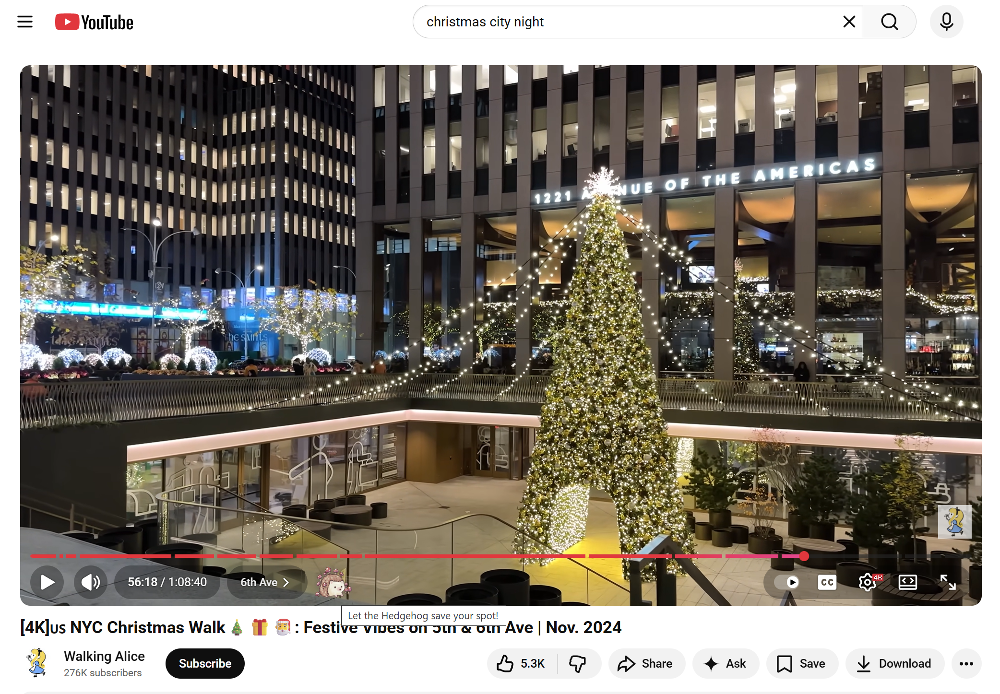
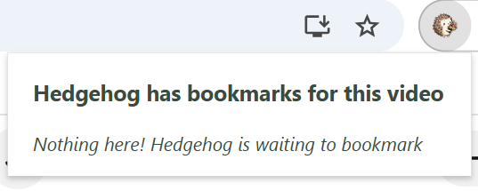
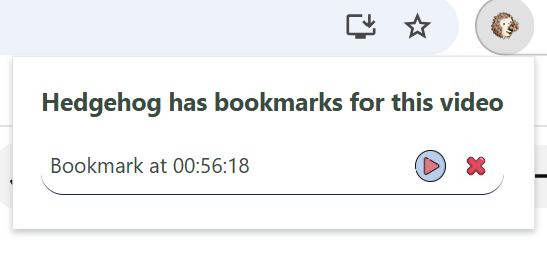
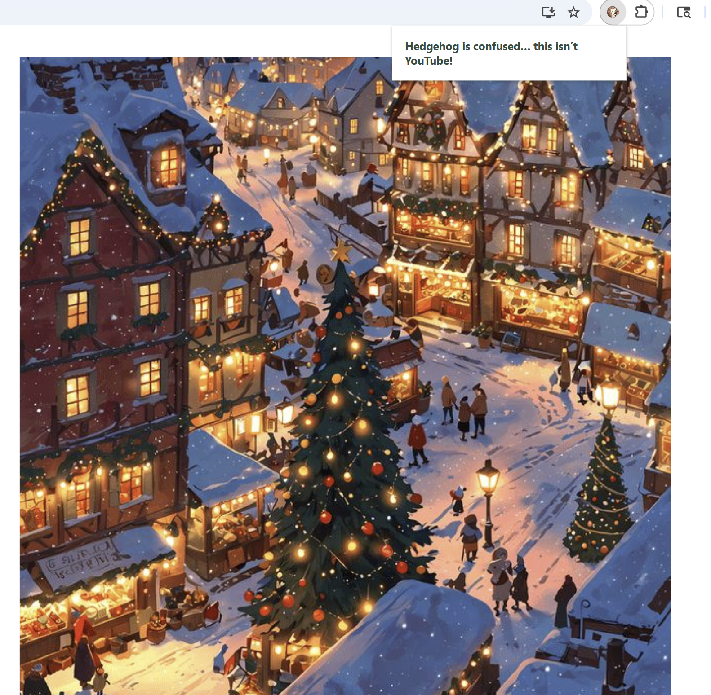

# 🦔 My Hedgehog Bookmarks

A Chrome extension that lets you bookmark specific moments in YouTube videos. Never lose your place again - let the Hedgehog save your spot!

## 📋 Table of Contents

- [Features](#features)
- [Quick Start](#quick-start)
- [Installation](#installation)
- [How to Use](#how-to-use)
- [Project Structure](#project-structure)
- [Technologies Used](#technologies-used)

## ✨ Features

- **Quick Bookmarking**: Add bookmarks to any YouTube video with a single click
- **Time-stamped Saves**: Each bookmark records the exact timestamp in the video
- **Easy Navigation**: Jump to any bookmarked moment instantly
- **Organized View**: See all your bookmarks in a clean, organized popup interface
- **Per-Video Storage**: Bookmarks are saved individually for each video
- **Persistent Data**: Your bookmarks sync across devices using Chrome's storage API
- **Delete Management**: Remove bookmarks you no longer need

## 🚀 Quick Start

1. Clone this repository
2. Open Chrome and navigate to `chrome://extensions/`
3. Enable "Developer mode"
4. Click "Load unpacked" and select the project folder
5. Visit any YouTube video and start bookmarking!

## 📥 Installation

### Prerequisites

- Google Chrome browser (or any Chromium-based browser)
- Basic knowledge of loading Chrome extensions

### Step-by-Step Installation

1. **Clone the repository**
   ```bash
   git clone https://github.com/yourusername/hedgehog-bookmarks.git
   cd hedgehog-bookmarks
   ```

2. **Load the extension in Chrome**
   - Open Google Chrome
   - Navigate to `chrome://extensions/`
   - Toggle on **Developer mode** (top right corner)
   - Click **Load unpacked**
   - Select the project directory

3. **Verify installation**
   - You should see the Hedgehog Bookmarks icon in your Chrome toolbar
   - The extension is now ready to use!

## 🎯 How to Use

### Creating a Bookmark

1. **Navigate to a YouTube video**
   - Go to any YouTube video (e.g., `https://www.youtube.com/watch?v=...`)

2. **Find the bookmark button**
   - Look for the bookmark icon in the YouTube player controls (left side)
   - The icon appears automatically when the video loads

3. **Add a bookmark**
   - Play the video to the moment you want to bookmark
   - Click the bookmark button
   - Your bookmark is automatically saved!

### Viewing Your Bookmarks

1. **Open the extension popup**
   - Click the Hedgehog Bookmarks icon in your Chrome toolbar
   - You'll see all bookmarks for the current video

2. **Bookmark information**
   - Each bookmark shows the timestamp (HH:MM:SS format)
   - Bookmarks are automatically sorted by time

### Playing a Bookmark

1. **Click the play button** (▶️) next to any bookmark
2. The video will jump to that exact moment

### Deleting a Bookmark

1. **Click the delete button** (🗑️) next to any bookmark
2. The bookmark will be removed immediately

## 📸 Screenshots
**Bookmark Button on YouTube Player**
<p align="center">
  
</p>
The bookmark button appears in the YouTube player controls with the tooltip "Let the Hedgehog save your spot!"

**Extension Popup - Empty State**
<p align="center">
  
</p>
When no bookmarks exist yet, Hedgehog is waiting to bookmark

**Extension Popup - With Bookmarks**
<p align="center">
  
</p>
View and manage your bookmarks - click play to jump to that moment, or delete to remove it

**Not on YouTube?**
<p align="center">
  
</p>
Hedgehog only works on YouTube watch pages - you'll see this friendly message on other sites

## 📁 Project Structure

```
hedgehog-bookmarks/
├── manifest.json          # Extension configuration
├── background.js          # Service worker for tab monitoring
├── contentScript.js       # Injected script for YouTube pages
├── popup.html             # Popup interface HTML
├── popup.css              # Popup styling
├── popup.js               # Popup functionality
├── utils.js               # Utility functions
└── assets/                # Icons and images
    ├── bookmark.png
    ├── play.png
    ├── delete.png
    ├── save.png
    └── ext-icon.png
```

## 🛠️ Technologies Used

- **JavaScript (ES6+)**: Core functionality
- **Chrome Extensions API**: Browser integration
- **Chrome Storage API**: Data persistence
- **HTML5 & CSS3**: User interface
- **Manifest V3**: Latest Chrome extension standard

## 🙏 Acknowledgments

- Inspired by the need for better YouTube navigation
- Built with ❤️ for the developer community

---

**Note**: This extension requires appropriate assets in the `assets/` folder:
- `bookmark.png` - Main bookmark button icon
- `play.png` - Play button icon
- `delete.png` - Delete button icon
- `save.png` - Save button icon
- `ext-icon.png` - Extension icon (16x16, 24x24, 32x32, 48x48, 128x128)

## 📧 Contact

If you have any questions or suggestions, feel free to open an issue or reach out!

Happy bookmarking! 🦔✨
